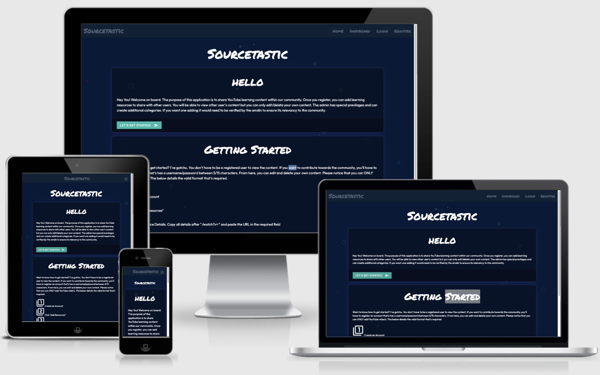

  Python Flask Video Uploading Web Application
  <h1 align="center">Trivia Game Night</h1>
 
# Purpose 
This application was developed to aid small tech teams to collaborate and share YouTube learning resources in one centralized system. I have found myself within several online tech communities where members where posting links for learning resources but they used to get lost with an array of different messages. This application was developed to solve that issue.
# User Experience (UX)
## Stratergy: 
This application will allow a member to create an account and add learning resources to share with other users. A user can only edit or delete there OWN resource and do not have access to alter other team members content. There is also an Admin account where they have the additional functionality of adding a category. This user will tend to be a moderator or an the lead of the community.

The objective is to create a platform where members of a community can share learning resources for a range of different tech categories. Although the application is appropriate for people of all ages, the interface must be visually pleasing to boost user engagement and acceptability across different age groups

-	### User stories
	-	As a user, I would like to view all learning resources 
	-	As a user, I would like to be instructions on how to add a new resource
	-	As a user, I would like to edit and delete a post 
	-	As a user, I would like to know who has created a post
	-	As a user, I would like informed responses on system actions 
	-	As a user, I would like to view the application on various devices 

## Scope:
The application has a set of categories that are restricted by the admin user. This is to ensure that the categories are aligned to what the tech community are intrested in and prevent users from adding content that aren't relevant. There are no limitations to how many resources a user can add within the application.

## Structure:
To enable consistancy throughout the applicatuon, the Python template engine of "Jinja" was used to help structure the HMTL pages. Jinja is a modern day templating language for Python developers. Jinija templates include inheritance which  is used to prevent repeated code. This saves a lot of time and reduces work. A base template contains the basic layout which is common to all the other templates. This is beneficial as it provides a level of consistency throughout the application structure. 

## Skeleton:
Prior to the development of the project, I sketched out my initial idea in Balsamiq Wireframes to provide a visual representation of how the application will look like. This has helped when creating the application as it allowed for guide to follow during development. I have kept the layout pretty straightforward as this is a CRUD application. In order allow these database interactions, I have used forms to create resources and update resources. The application will be reading resources and displaying them on individual cards. 

My initial design did not include a landing page, instead the user was navigated to the resource page on their first visit. This was a bad idea as the user would not have any context of the application purpose and the user isn't provided with instructions on how to use the application either. 

## Surface:

### Front-end Framework -  [Materialize](https://materializecss.com/)
-	The front-end framework of Materialize was used to build the styling components of the application. Materialize does alot of the heavy lifting for you and provides  default stylings that speed up the development process.

### Live background -  [Loading.io](https://loading.io/background/m-interstellar/)
-   The live background was implemented into the site by using an SVG file. I have chosen the "ripple" effect to keep it minimalistic to not distract the user whilst using the application. 

### Custom Font -  [Google Fonts](https://fonts.google.com/specimen/Permanent+Marker)
-   To make the headings stand out on the web pages i have selected the "Permanant Marker" font to catch the user's attention. For text I have used "Outfit".

### Glass Cards-  [Glassmorphism](https://hype4.academy/tools/glassmorphism-generator)
-   This generator was used to create the background styling for the card components on the application. It was simple to use and provided CSS that's required for the desired effect.

## Features
-	Connectivity to mongoDB database. 
-	User can Create, Read, Update and Delete items from database.
-	Responsive on all device sizes

## Technologies Used

### Languages Used
 1. HTML 
 2. CSS/Materialize 

 3.  JavaScipt
 4.    MongoDB
 5.    Python
 

### Frameworks, Libraries & Programs Used
1.  [Flask:](https://flask.palletsprojects.com/en/2.0.x/)
-   Flask provided tools, libraries and technologies that helped build the application. One of the tools used was the Jinja templates.

2.  [Google Fonts:](https://fonts.google.com/)

-   Google fonts were used to import the 'Ubuntu Condensed' font into the style.css file which is used on all pages throughout the project.

3.  [Font Awesome:](https://fontawesome.com/)

-   Font Awesome was used on all pages throughout the website to add icons for aesthetic and UX purposes.

4.  [jQuery:](https://jquery.com/)

-   jQuery came with Materialize to aid the frameworks interactive features.

5.  [Git](https://git-scm.com/)

-   Git was used for version control by utilizing the Gitpod terminal to commit to Git and Push to GitHub.

6.  [GitHub:](https://github.com/)

-   GitHub is used to store the project's code after being pushed from Git.

7.  [Balsamiq:](https://balsamiq.com/)

-   Balsamiq was used to create the  [wireframes](https://github.com/)  during the design process.

# Testing

For the testng of the application I have validated my code and run the application through some user acceptance testing. This involved writing test cases and running the application through given scenarios to see how it responds. Please find the results of my tetsting [here](Testing.md)

### Future Development 

## Deployment

## Forking the GitHub Repository

Forking a repository enables us to make a copy of the original repository on our GitHub account so we can view it and make changes with out affecting the original work.
This is done using the following steps:
 1. Log in to [GitHub](https://github.com/shaff600) account and select the relevant repository.
 2. To the top right of the page there are three the buttons, the furthest right says **Fork.** Click on this button.
 3. A copy of the original repository will now be in your account.

## Making a Clone

To make a clone of my project use the following steps:
 1. Go to my [account](https://github.com/shaff600) and locate relevant repository.
 2. Next to the green **Gitpod** button, click on **CODE.**
 3. Click on **Download Zip.**
 4. Once dowloaded, you can extract the zip file's contents and save to a desktop and run the website locally.

 ## MongoDB

 - Create and account
 - Create a cluster
 - Select your region (or the closest one)
 - Go to Database Access and Add new database user
 - In drop down menu select 'read and write to any database'
 - In main menue, select Network Access and Add IP address
 - In collections section of your cluster select 'Create Database'
 - Create your first collection when prompted, then add your requiered collections
 - Insert documents via the 'Insert Document' button
 
 ## Setting up the app

 - Within you work inviroment terminal:
    - instal Flask. 'pip3 install Flask' 
    - Create files. 
        - 'touch app .py'
        - 'touch env .py'
        - 'touch .gitignore'
- Within the .gitignore file add:
    - env .py
    - __ pycache __/
- Within the env .py file, import operating systems, and enviroment variables:
    - 'import os'
    - 'os.environ.setdefault("IP". "0.0.0.0")'
    - 'os.environ.setdefault("PORT", "5000")'
    - 'os.environ.setdefault("SERCRET_KEY", "YOUR SECRET KEY")' I used [RandomKeyGen](https://randomkeygen.com/) to get my secret key.
    - 'os.environ.setdefault("MONGO_URI", "YOUR MONGO URI")' 
        - To get you monmgo URI go to; Cluster > Overview > Connect > Connect your application. Choose the version of Python you are using, then you can copy and past the sting thats displayed. You will have to update the <database name> and <password>.
    - 'os.environ.setdefault("MONGO_DBNAME", "YOUR DATABASE NAME")

- Within the app .py file, import opperating systems and flask requirements:
    - 'import os'
    - 'from flask import Flask, flash, render_template, redirect, request, session, url_for'
    - 'if os.path.exists("env,py"): import env' 
    - Create app variable:
        - 'app = Flask (__ name __)

## Deploying to Heroku

- Set up the files that Heroku will need. In the terminal of your work enviroment type:
    - 'pip3 freeze --lead > requirements.txt
    - 'echo web: python app .py > Procfile'

- Push files to github before deploying to Heroku

- On Heroku:
    - Create a new app
    - pick deployment method 'Github' for automatic deployment
    - find your repo and connect to app
    - go to settings > Reveal Config vars
        - Add IP, PORT, SECRET_KEY, MONGO_URI and MONGO_DBNAME
    - enable auto deployment
    - deploy

## Connect Flask to MongoDB

- In the terminal of your work enviroment:
    - 'pip3 install flask-pymongo'
    - 'pip3 install dnspython'
    - pip3 freeze -- local > requirements.txt

- In yopur app-py file:
    - 'from flask_pymongo import PyMongo
    - 'from bson.objectid import ObjectId'
    - 'app.config["MONGO_DBNAME"] = os.environ.get["MONGO_DBNAME"]
    - 'app.config["MONGO_URI"] = os.environ.get["MONGO_URI"]
    - 'app.secret_key = os.environ.get["SECRET_KEY"]
    - 'mongo = PyMongo(app)'
    
 

## Credits

### Sources 

### Acknowledgements
