# Testing
Testing was done throughout the project via chrome development tools. I also used various code validators to make sure my code was free of errors.

## Contents

- [Validators](#validators)
    - [W3C](#w3c)
    - [PEP8](#pep8)
    - [JSHint](#jshint)
    - [User Stories](#user-stories)
    - [Manual Testing](#manual-testing)
    - [Summary](#summary)

## Validators

- ### [W3C](https://validator.w3.org/nu/)
- As the Jinja template was being used througout the HTML pages, the validator was indicating error where it picked up the Jinja syntax. There where some minor usses with the HTML of which I have rectified:
- 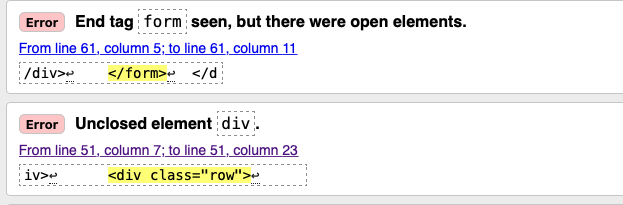
- 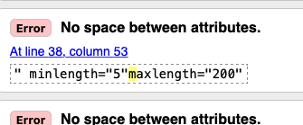

    - ### add_category.html
    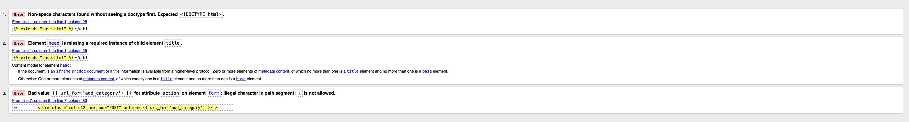
    - ### add_resources.html
    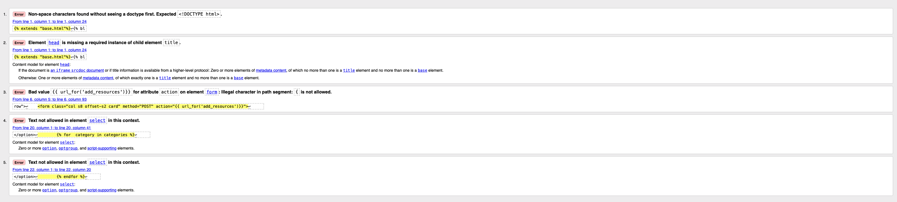
    - ### base.html
    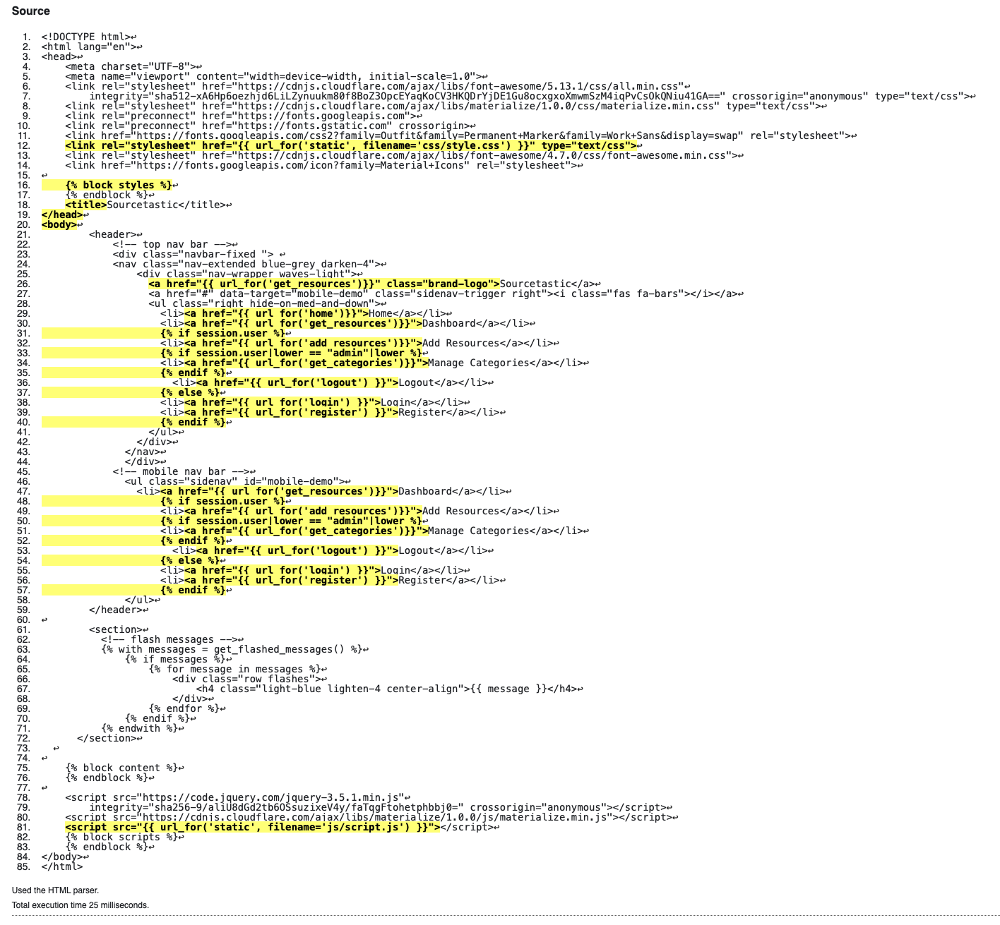
    - ### category.html
    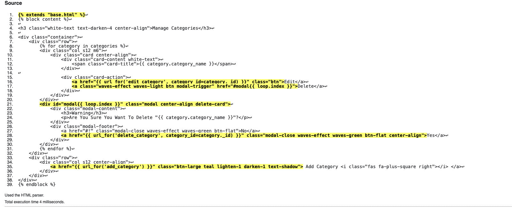
    - ### edit_category.html
    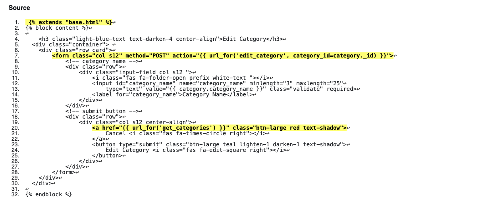
    - ### home.html
    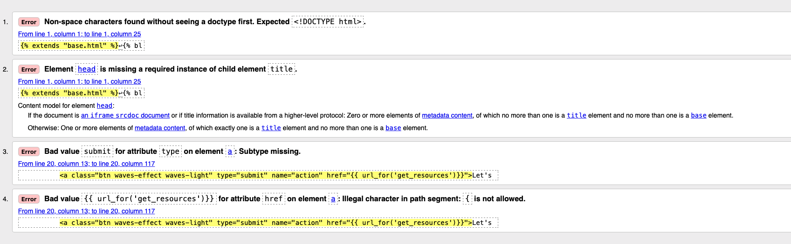
    - ### login.html
    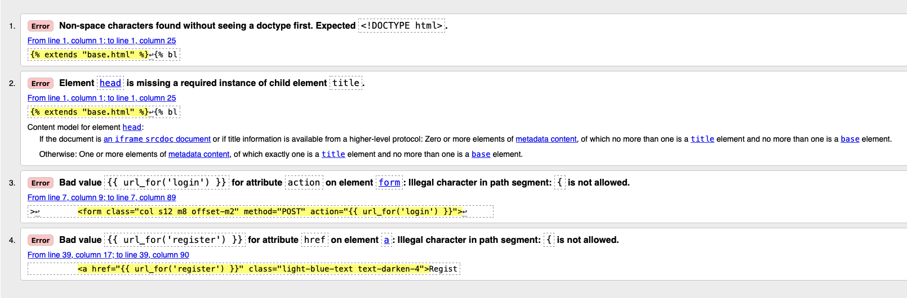
    - ### register.html
    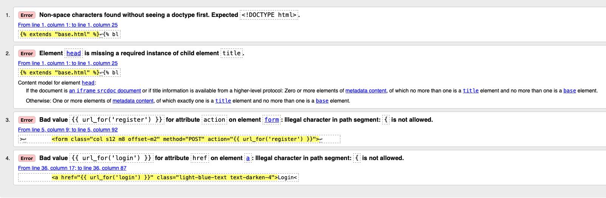
    - ### resources.html
    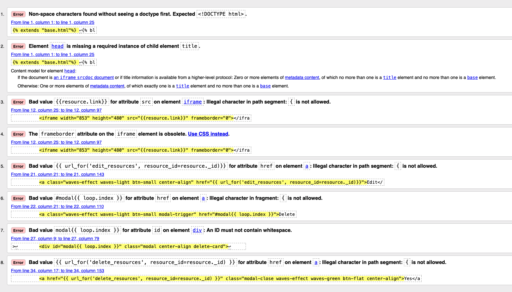
    
- ### [PEP8](http://pep8online.com/)
  - ### before
    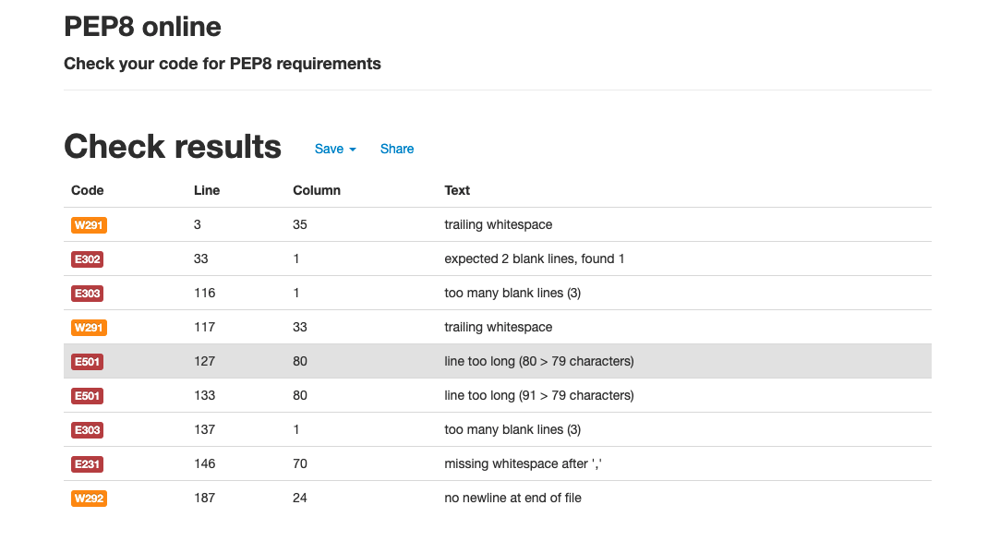
   - ### after
    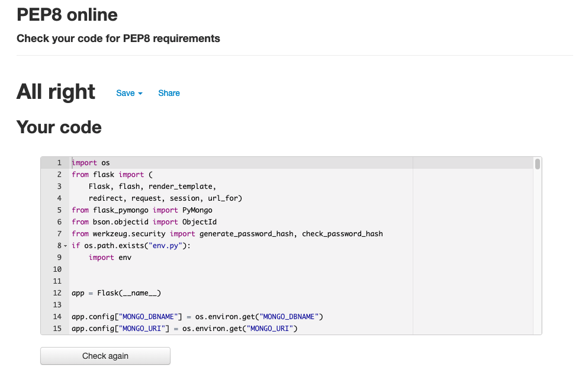
    
- ### [JSHint]()

    - ### script.js
    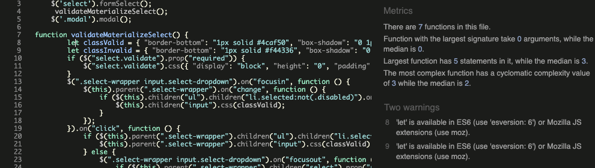
    
    
## User Stories
#Testing User Stories from User Experience (UX) Section

1. As a user, I would like to view all learning resources
    - The user is able to view all resources as a non-registered and registered user
2. As a user, I would like to be instructions on how to add a new resource
    - When the user first acceses the site they are welcomed to a landing page which includes instructions 
3. As a user, I would like to edit and delete a post
   - User can only edit or delte a post they create. They have to be registered user to do this.
4. As a user, I would like to know who has created a post.
   - Under every item there is details of who created the post
5. As a user, I would like informed responses on system actions
    - Modals and labels are shown to the user when they create, update and delete items.
6. As a user, I would like to view the application on various devices
    - The application is responsive on all devices

## Manual Testing

 ### Navigation 

TEST            | OUTCOME                          | PASS / FAIL  
--------------- | -------------------------------- | ---------------
Home page | on click to "Home", the browser redirects me to the home page.| PASS
Dashboard page | on click page is redirected to dashboard to view resources | PASS
Register page| on click to "feedback page", the browser redirects me to the register page | PASS
Login Page| Page redirected to login form.| PASS
Foreground & background  color| Checked foreground information is not distracted by backgrounds| PASS
Text|Checked if all fonts and colors used are consistent or not|PASS

 ### Landing Page 

TEST            | OUTCOME                          | PASS / FAIL  
--------------- | -------------------------------- | ---------------
Click "Let's Get Started Button" | on click page is redirected to dashboard page that includes resources| PASS

 ### Register Page

TEST            | OUTCOME                          | PASS / FAIL  
--------------- | -------------------------------- | ---------------
Enter username less then 5 char long | field highlights in red to indicate error| PASS
Enter username longer then 5 char| field turns green| PASS
Enter username longer then 15 char| field highlights in red to indicate error| PASS
Enter password less then 5 char long | field highlights in red to indicate error| PASS
Enter password longer then 5 char| field turns green| PASS
Enter password longer then 15 char| field highlights in red to indicate error| PASS
Enter username and password between the length of 15 char and click submit| redirected to dashboard| PASS

 ### Login Page

TEST            | OUTCOME                          | PASS / FAIL  
--------------- | -------------------------------- | ---------------
Enter username and password thats already registered| Error message is displayed| PASS
Enter username longer then 5 char| field turns green| PASS
Enter username longer then 15 char| field highlights in red to indicate error| PASS
Enter password less then 5 char long | field highlights in red to indicate error| PASS
Enter password longer then 5 char| field turns green| PASS
Enter password longer then 15 char| field highlights in red to indicate error| PASS
Enter username and password between the length of 15 char and click submit| redirected to dashboard| PASS

### Dashboard

TEST            | OUTCOME                          | PASS / FAIL  
--------------- | -------------------------------- | ---------------
View all available resources| each resource is displayed in its own card | PASS
Play video| YouTube video's are playable | PASS
Attempt to delete other user posts | button is not available | Pass
Attempt to create a category as a user | "Manage Categories" is not displayed in navbar | PASS

### Logout once Logged in

TEST            | OUTCOME                          | PASS / FAIL  
--------------- | -------------------------------- | ---------------
Click "Logout" in navbar| Confirmation of being logged out| PASS

### Add Resources Page as a User

TEST            | OUTCOME                          | PASS / FAIL  
--------------- | -------------------------------- | ---------------
Enter resource name longer then 15| field turns red to indicate error| PASS
Enter resource name shorter then 5 |field turns red| PASS
Click on "Choose Category" to populate drop down | Selection of categories are displayed| PASS
Delete value from "Youtube" link | User is able to delete link| FAIL
Enter resource description longer then 75 char| field turns red| PASS
Enter resource description shorter then 10 char| field turns red| PASS
Enter resource name between 5/15 char, choose category, include embeded YouTube Link, add description between 10/75 char and click submit| label is displayed confirming resource has been added, redirected to dashboard| PASS

### Edit User's Post

TEST            | OUTCOME                          | PASS / FAIL  
--------------- | -------------------------------- | ---------------
Click "Edit" button under newly created post| redirected to edit resource page | PASS
Form is pre-populated with resource details| form contains resource data| PASS
Click "Category" to generate drop down | categories are displayed | PASS
Click "Cancel" | page is redirected to dashboard | PASS
Make change and click "Edit Resource" | label is displayed confirming change has been actioned | PASS

### Delete User's Post

TEST            | OUTCOME                          | PASS / FAIL  
--------------- | -------------------------------- | ---------------
Click "Delete" button under newly created post| modal | PASS
Click "No" on modal | modal closes down | PASS
Click "Yes" on modal | label displayed and resource is removed from dashboard | PASS

### Manage Categories (Admin only)

TEST            | OUTCOME                          | PASS / FAIL  
--------------- | -------------------------------- | ---------------
Log into system as Admin| "Manage Categories" visible on nav bar | PASS
Click "Manage Categories" | page displays all categories| PASS
Click "Edit" button under a category| redirected to edit category page | PASS
Form is pre-populated with resource details| form contains selected category data| PASS
Clicl "Cancel" on edit category| page redirected to manage categories | PASS
Click "Delete" button under category | modal is genereated | PASS
Click "No" on modal | modal closes down | PASS
Click "Yes" on modal | label displayed and category is removed from group of categories | PASS
Click "Add Category" | user is able to enter a new category | PASS

# Summary
   -   As a result of running the validator for the HTML, it was shown that the jinja templating language was causing issues however this is expected as the tool is not recognising the templating lanugage. There where few minor error it had picked up which was swiftly rectified. 
   -   There where no issues with testing against the user stories.
   -   Currently a user can delete the pre-defined HTML value when entering a YouTube link which may cause issues, i.e a user may overwrite the Youtube link that does not incude embedded elements. More work would need to be done here to validate the user's input to ensure it meets the requirments for an embedded link.
